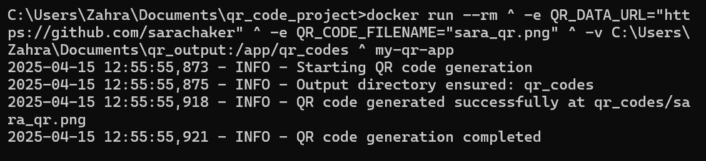

# 📦 QR Code Generator with Docker & Python

This project is a simple Python-based QR code generator that runs inside a Docker container.  
It generates a QR code PNG that links to your GitHub profile and saves it to a directory inside the container (or a shared folder on the host).

---

## 🧪 How it Works

- Python script uses `qrcode` and `Pillow` to generate a QR code.
- Docker container sets up a lightweight Python environment.
- Environment variables control the QR code content, filename, and style (fill/background color).
- Outputs the PNG file to `qr_codes/` folder.

---

## ⚙️ Environment Variables

You can customize your QR code by passing these when running the container:

| Variable         | Description                                | Default                          |
|------------------|--------------------------------------------|----------------------------------|
| `QR_DATA_URL`     | The URL to encode in the QR code           | `https://github.com/YOUR_NAME`   |
| `QR_CODE_DIR`     | Directory to save the QR code              | `qr_codes`                       |
| `QR_CODE_FILENAME`| Name of the output QR code image           | `my_qr.png`                      |
| `FILL_COLOR`      | QR code color                              | `black`                          |
| `BACK_COLOR`      | Background color of QR code                | `white`                          |

---

## ✅ Output

### 🔳 QR Code Image
The QR code generated points to your GitHub profile:

---

### 📜 Log Output Screenshot

This shows the terminal output when the QR code is generated:

---

## 📦 Tech Stack

- Python 3.9 (Slim)
- Docker
- `qrcode` & `pillow` libraries
